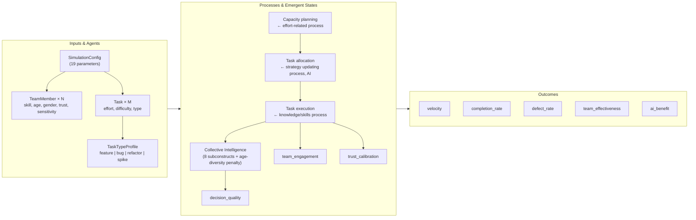
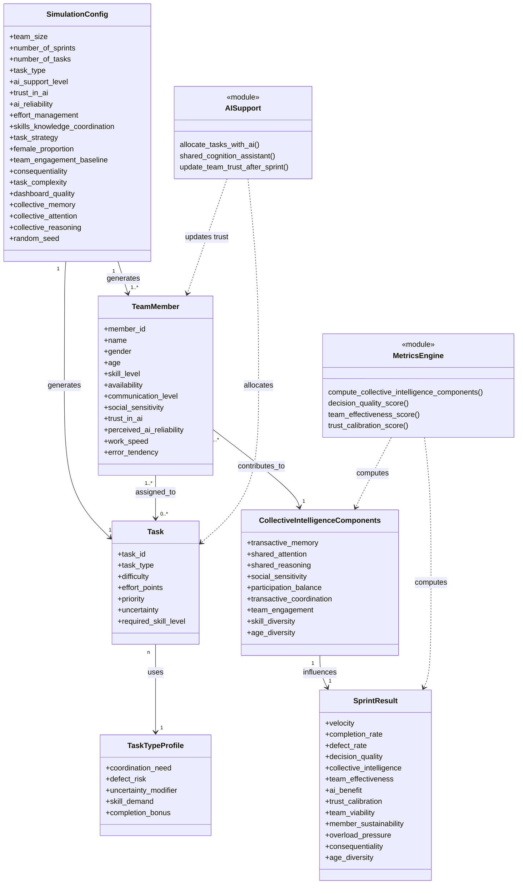
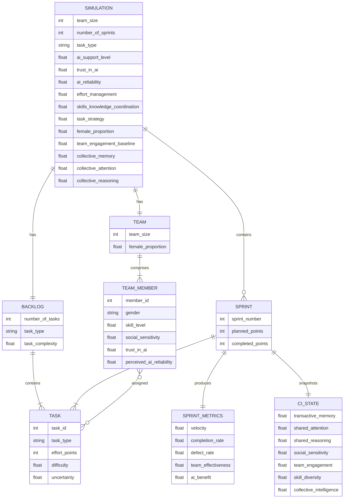
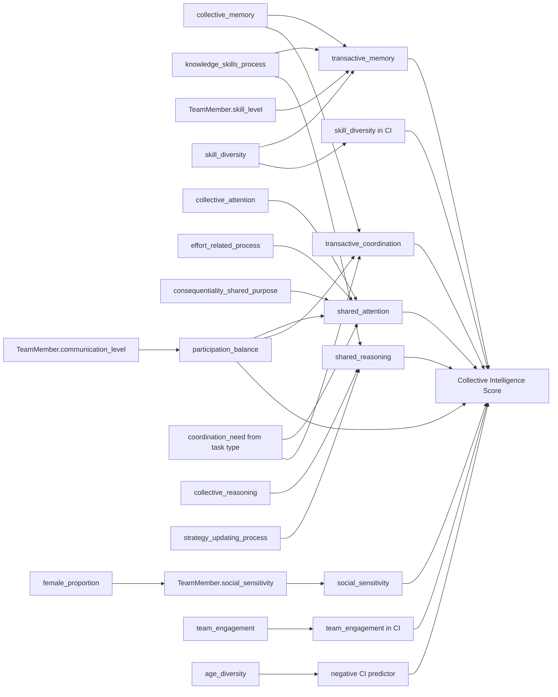
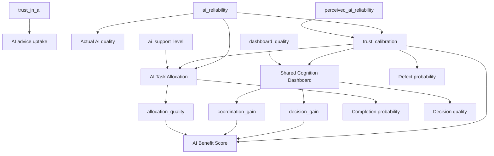
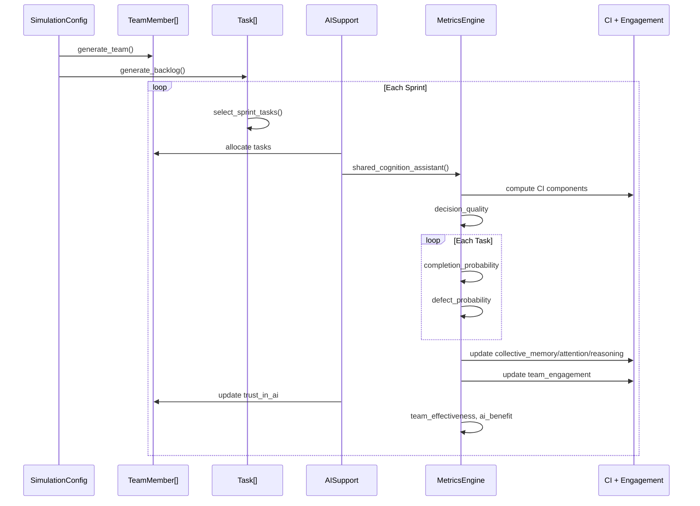
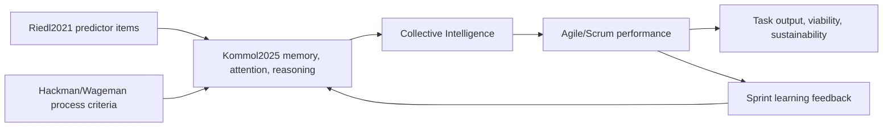

# Conceptual Model — Agile AI Simulator

This document describes the structure, variables, and causal relationships in the Agile AI Simulator. Each diagram is also available as a standalone Mermaid file under [`docs/diagrams/`](diagrams/) for import into draw.io, Mermaid Live Editor, or presentation tools.

**For your presentation:** use [`PRESENTATION_ONE_PAGE.mmd`](diagrams/PRESENTATION_ONE_PAGE.mmd) or open [`PRESENTATION_ONE_PAGE.html`](PRESENTATION_ONE_PAGE.html) in a browser and export to PDF/image.

---

## Table of contents

1. [One-page overview (presentation)](#1-one-page-overview-presentation)
2. [UML class diagram](#2-uml-class-diagram)
3. [Variable flow / causal model](#3-variable-flow--causal-model)
4. [Entity–relationship view](#4-entityrelationship-view)
5. [Collective Intelligence sub-model](#5-collective-intelligence-sub-model)
6. [Human–AI teaming sub-model](#6-humanai-teaming-sub-model)
7. [Sprint lifecycle (sequence)](#7-sprint-lifecycle-sequence)
8. [Scrum, CI, and team effectiveness bridge](#8-scrum-ci-and-team-effectiveness-bridge)
9. [Variable dictionary](#9-variable-dictionary)

---

## 1. One-page overview (presentation)

Three-panel view: **Inputs & agents → Processes & emergent states → Outcomes**.

See: [`diagrams/PRESENTATION_ONE_PAGE.mmd`](diagrams/PRESENTATION_ONE_PAGE.mmd)

---

## 2. UML class diagram

See: [`diagrams/01_uml_class_diagram.mmd`](diagrams/01_uml_class_diagram.mmd)

| Class | Role |
|---|---|
| `SimulationConfig` | All user-controlled inputs (`simulation.py`) |
| `TeamMember` | Individual agents (`team.py`) |
| `Task` | Backlog / sprint work items (`tasks.py`) |
| `TaskTypeProfile` | Lookup table: feature, bug, refactor, spike |
| `CollectiveIntelligenceComponents` | Emergent team cognition state (`metrics.py`) |
| `SprintResult` | Outputs recorded per sprint |
| `AISupport` / `MetricsEngine` | Behavioral modules (`ai_support.py`, `metrics.py`) |

---

## 3. Variable flow / causal model

See: [`diagrams/02_variable_flow_causal.mmd`](diagrams/02_variable_flow_causal.mmd)

```mermaid
flowchart TB
    subgraph inputs [Inputs — SimulationConfig]
        TS[team_size]
        NS[number_of_sprints]
        NT[number_of_tasks]
        TT[task_type]
        TC[task_complexity]
        AI[ai_support_level]
        TR[trust_in_ai]
        AR[ai_reliability]
        DQ[dashboard_quality]
        EM[effort_related_process]
        SK[knowledge_skills_process]
        TS2[strategy_updating_process]
        FP[female_proportion]
        TEB[team_engagement_baseline]
        CON[consequentiality_shared_purpose]
        CM[collective_memory]
        CA[collective_attention]
        CR[collective_reasoning]
    end

    subgraph agents [Agents]
        TM[TeamMember attributes]
        TK[Task attributes]
        TTP[TaskTypeProfile]
    end

    subgraph processes [Team Processes per Sprint]
        CAP[Capacity planning]
        ALLOC[Task allocation]
        EXEC[Task execution]
        REV[Outcome evaluation]
        TRUST[Trust learning]
    end

    subgraph emergent [Emergent States]
        TE[team_engagement]
        CI[CollectiveIntelligenceComponents]
        TC2[trust_calibration]
        DQ2[decision_quality]
    end

    subgraph outcomes [Outcomes]
        VEL[velocity]
        COMP[completion_rate]
        DEF[defect_rate]
        EFF[team_effectiveness]
        TV[team_viability]
        MS[member_sustainability]
        OP[overload_pressure]
        AIB[ai_benefit]
    end

    inputs --> agents
    FP --> TM
    TT --> TTP
    TTP --> TK

    agents --> processes
    EM --> CAP
    CON --> TE
    CON --> MS
    TS2 --> ALLOC
    SK --> EXEC
    AI --> ALLOC
    AR --> ALLOC

    processes --> emergent
    CM --> CI
    CA --> CI
    CR --> CI
    TM --> CI
    TEB --> TE
    REV --> TE
    AR --> TC2
    TM --> TC2

    emergent --> outcomes
    CI --> EFF
    DQ2 --> EFF
    CI --> TV
    TE --> TV
    TE --> MS
    CAP --> OP
    OP --> MS
    TV --> EFF
    MS --> EFF
    TE --> COMP
    SK --> DEF
    AI --> AIB
```

---

## 4. Entity–relationship view

See: [`diagrams/03_entity_relationship.mmd`](diagrams/03_entity_relationship.mmd)

**Cardinality summary**

| Relationship | Cardinality |
|---|---|
| Simulation → Sprint | 1 : many |
| Simulation → Team | 1 : 1 |
| Team → TeamMember | 1 : many |
| Simulation → Backlog | 1 : 1 |
| Backlog → Task | 1 : many |
| Sprint → Task | many : many (subset per sprint) |
| TeamMember → Task | many : many (assignments) |
| Sprint → SprintMetrics | 1 : 1 |
| Sprint → CI State | 1 : 1 (evolving snapshot) |

---

## 5. Collective Intelligence sub-model

See: [`diagrams/04_collective_intelligence.mmd`](diagrams/04_collective_intelligence.mmd)

**CI component weights** (from `metrics.py`)

| Component | Weight |
|---|--:|
| Transactive memory | 18% |
| Shared attention | 16% |
| Shared reasoning | 16% |
| Social sensitivity | 16% |
| Participation balance | 10% |
| Transactive coordination | 10% |
| Team engagement | 8% |
| Skill diversity | 6% |

---

## 6. Human–AI teaming sub-model

See: [`diagrams/05_human_ai_teaming.mmd`](diagrams/05_human_ai_teaming.mmd)

**AI benefit weights** (from `metrics.py`)

| Component | Weight |
|---|--:|
| Allocation quality | 45% |
| Coordination gain | 30% |
| Decision gain | 25% |

Multiplied by `ai_support_level × trust_calibration`.

---

## 7. Sprint lifecycle (sequence)

See: [`diagrams/06_sprint_lifecycle.mmd`](diagrams/06_sprint_lifecycle.mmd)

---

## 8. Scrum, CI, and team effectiveness bridge

See: [`diagrams/08_scrum_ci_team_effectiveness_bridge.mmd`](diagrams/08_scrum_ci_team_effectiveness_bridge.mmd)

This bridge explains how the simulator connects the agile/Scrum literature to Collective Intelligence:

- **Verwijs & Russo (2023)** ground Scrum team effectiveness in responsiveness, stakeholder concern, continuous improvement, autonomy, and management support.
- **Strode, Dingsøyr & Lindsjørn (2022)** connect agile teamwork effectiveness to shared mental models, communication, and trust.
- **Riedl et al. (2021)** identify predictor items, especially effort-related process, strategy updating process, knowledge/skills process, individual skill, diversity, social perceptiveness, and female proportion as a proxy when social perceptiveness is not directly measured.
- **Kommol, Riedl & Woolley (2025)** assign these predictors to collective/shared memory, attention, and reasoning.
- **Hackman (1987)** and **Wageman, Hackman & Lehman (2005)** broaden team effectiveness beyond output to include future viability and member sustainability.
- **Consequentiality/shared purpose** is modeled as an upstream driver of team engagement, shared attention, team viability, and sustainability.

**Memory terminology:** `collective_memory` is the shared-memory baseline controlled by the user. `transactive_memory` is the computed CI component that operationalizes how that shared memory is accessed: who knows what, how differentiated the skills are, and how well the team coordinates knowledge.

**Process terminology:** `effort_management`, `skills_knowledge_coordination`, and `task_strategy` are displayed as effort-related process, knowledge/skills process, and strategy updating process. They are process measures, not individual attributes.

**Female proportion note:** because the simulator generates social sensitivity directly, female proportion should be read as a proxy pathway through social perceptiveness, not as a direct causal or biological claim.

**Percentage note:** The weights in the simulator are transparent modeling assumptions for explanation and sensitivity analysis. They are not empirical coefficients estimated from the papers.

---

## 9. Variable dictionary

| Role | Variables |
|---|---|
| **Structural inputs** | `team_size`, `number_of_sprints`, `number_of_tasks`, `task_type`, `task_complexity` |
| **Process measures** (Riedl / Hackman / Wageman) | `effort_management` as effort-related process, `skills_knowledge_coordination` as knowledge/skills process, `task_strategy` as strategy updating process |
| **Purpose and engagement** | `consequentiality`, `team_engagement_baseline`, emergent `team_engagement` |
| **Diversity** (Woolley / Hong & Page / professor feedback) | `female_proportion` through social sensitivity, `gender`, `skill_diversity`, `age`, `age_diversity` |
| **CI system baseline inputs** | `collective_memory` / shared memory, `collective_attention`, `collective_reasoning` |
| **AI inputs** | `ai_support_level`, `trust_in_ai`, `ai_reliability`, `dashboard_quality` |
| **Individual agent state** | `skill_level`, `age`, `availability`, `communication_level`, `social_sensitivity`, `trust_in_ai`, `perceived_ai_reliability`, `work_speed`, `error_tendency` |
| **Task state** | `difficulty`, `effort_points`, `priority`, `uncertainty`, `required_skill_level` |
| **Emergent team state** | `team_engagement`, CI subcomponents, `trust_calibration`, `decision_quality` |
| **Outcomes** | `velocity`, `completion_rate`, `defect_rate`, `team_effectiveness`, `team_viability`, `member_sustainability`, `age_diversity`, `ai_benefit` |

---

## Source files

| Module | Primary classes / functions |
|---|---|
| `simulation.py` | `SimulationConfig`, sprint engine |
| `team.py` | `TeamMember`, `generate_team()` |
| `tasks.py` | `Task`, `TASK_TYPE_PROFILES` |
| `metrics.py` | `CollectiveIntelligenceComponents`, scoring functions |
| `ai_support.py` | Allocation, shared cognition, trust updates |
| `experiments.py` | Monte Carlo, sensitivity analysis |
| `app.py` | Streamlit UI |

---

## Which diagram for which audience?

| Question | Use |
|---|---|
| What are the main building blocks? | UML class diagram (§2) |
| How do variables influence outcomes? | Causal variable graph (§3) |
| What is stored vs. computed? | Entity–relationship view (§4) |
| What is Collective Intelligence here? | CI sub-model (§5) |
| How does AI fit in? | Human–AI sub-model (§6) |
| What happens each sprint? | Sprint lifecycle (§7) |
| How do Scrum, CI, and team effectiveness connect? | Scrum-CI bridge (§8) |
| One slide for the whole model | One-page overview (§1) |
