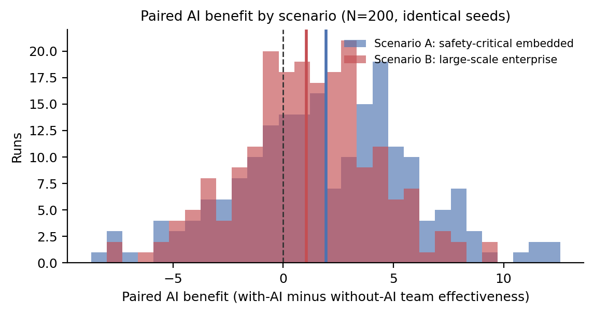
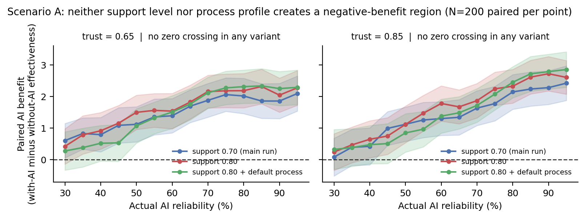
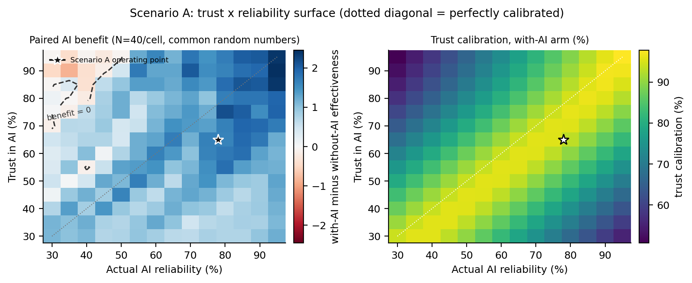

# CITAS Demonstration Scenarios — Progress Report

Two empirically anchored scenarios were encoded, run against CITAS v2.1, and documented to the ODD protocol. The headline result is a null: in the safety-critical scenario, AI benefit never turns negative across the reliability range — and two isolating sweeps plus a bit-for-bit positive control show this is a real property of the configuration, not of support level, process profile, or the harness.

Full numbers: [`../results_scenarios/RESULTS_SUMMARY.md`](../results_scenarios/RESULTS_SUMMARY.md). ODD documentation: [`../scenarios/README.md`](../scenarios/README.md).

## 1. Summary of findings

Every number comes from an executed run. Status labels mark what is established, what was corrected, and what remains a hypothesis.

- **[Verified] AI support produces a clear, positive effectiveness gain in both scenarios.** Scenario A +1.95 [+1.40, +2.51]; Scenario B +1.06 [+0.63, +1.49] (paired, N = 200, identical seeds). The CIs do not overlap.
- **[Verified] Scenario A shows no zero crossing of AI benefit at any reliability from 0.30 to 0.95,** at trust 0.65 or 0.85. The thesis located a crossing near 48% on its baseline configuration.
- **[Verified] Neither the AI support level nor the process profile explains the missing crossing.** Raising support to 0.80, and separately resetting all four process parameters to defaults, still yields no crossing. A positive control reproduces the thesis crossing bit-for-bit, so the harness is sound.
- **[Hypothesis] The remaining candidates are sprint count (12 vs 8) and dependency density / complexity.** Both have a plausible mechanism; neither has been tested. The paper must not attribute the null harm to process discipline.
- **[Verified] The thesis's `results_v20/` data is genuine v2.0, not a hybrid.** It reproduces bit-for-bit from the pre-v2.1 commit. Only the documentation wording about the config switch needs correcting.

## 2. Scope and deliverables

Two scenarios anchored in published case studies were encoded as configuration, run against CITAS v2.1, and documented to the ODD protocol. The deliverables:

| Deliverable | Location | Notes |
|---|---|---|
| Scenario configurations | `scenarios/__init__.py` | Two configs as commented dicts (thesis `PRESETS` convention); REP/DER/ASS basis code and justification on every parameter; anchor citations verbatim |
| Runner | `run_scenarios.py` | Paired arms (A, B), reliability sweep (A), trust × reliability grid (A). Refuses to run unless model is 2.1.0 with anchor `trust` |
| Supplementary runner | `run_scenarios_support_sweep.py` | Isolating sweeps at support 0.80, with a `--default-process` flag |
| Results | `results_scenarios/` | All CSVs plus `run_report*.json` (model version, seeds, replication counts, timing) |
| Figures | `results_scenarios/figures/` | Four figures following `make_figures.py` conventions; each opened and checked |
| ODD documentation | `scenarios/README.md` | Grimm et al. (2020) structure; intended as a paper appendix |
| Results summary | `results_scenarios/RESULTS_SUMMARY.md` | Paper-ready numbers, interpretation, open questions |

## 3. Approach and corrections made during implementation

**Anchoring.** Scenario A — safety-critical embedded (EBCU with coupled ICU, ISO 26262); quantitative anchor Van Schooenderwoert (2006), carried with the caveat that it is an industry experience report, not an independent study; process/regulatory characteristics from Diebold & Mayer (2017) and Heeager & Nielsen (2020). Scenario B — large-scale enterprise IS (public-sector pension provider, ~2,500 stories, 12 parallel teams), anchored in Dingsøyr, Moe & Seim (2018); one representative team modelled. Every parameter carries a basis code (REP / DER / ASS) in the code itself.

**Parameter mapping.** All 19 names in the specification are verbatim `SimulationConfig` identifiers. Three required parameters the specification omitted were added, all ASS: `female_proportion` 0.50, `team_engagement_baseline` 0.65, `random_seed` 42.

**Three design decisions:**

- **[Corrected] Four-week-increment variant dropped.** CITAS abstracts over calendar time; iteration length is not a parameter. Halving sprints answers a different question; a linear capacity multiplier encodes an unevidenced assumption. Recorded in the ODD as outside scope, with Heeager & Nielsen's cadence-strain finding flagged as future work.
- **[Corrected] Skill narrative reframed.** Agent skill is a fixed distribution with no learning; Scenario A's inexperienced staffing is operationalised via reduced collective memory (0.50) and coordination capability (0.60). `skill_diversity` is an output, not an input.
- **[Corrected] Baseline arm redefined.** `ai_support_level = 0` is not a no-AI condition (it still runs the AI allocator, the assistant, and the misfit penalty). All baselines use `use_ai=False`, matching the thesis `paired_ai_benefit` convention.

**Experimental discipline.** 200 paired runs for arms and sweeps; 40 per grid cell. Seeds `42 + i`, identical within each pair and across every grid cell (common random numbers). 95% CI = mean ± 1.96·SE; SE reported per cell. Runner exits unless model is 2.1.0 with anchor `trust`. Main run: 27,680 simulations in 92.5 s; each supplementary sweep 11,200 in 37 s.

## 4. Integrity checks

- **[Verified] `results_v20/` is genuine v2.0.** Its `exp1_ci_levels.csv` and `exp2_trust_scenarios.csv` reproduce with zero difference from commit `50c9266`, where all four v2.1 mechanics were absent. The thesis Fig 5 overlay is correctly labelled. Only the `weights.yaml` comment and Appendix B.6/C.4.3 wording (claiming the switch restores v2.0 exactly) need correcting.
- **[Verified] Positive control.** The scenarios harness on the thesis crossing configuration (defaults, trust 0.85, support 0.80, N = 60) reproduces `results/ai_reliability_crossing.csv` exactly — −1.26 [−2.23, −0.29] at reliability 0.30, crossing between 0.45 and 0.50.
- **[Verified] Nothing existing touched.** `git diff` across `results/`, `results_v20/`, `figures/`, `make_figures.py` and every model file is empty. No TODO markers.

## 5. Results

### 5.1 Paired arms (N = 200)

| Metric | Scenario A | Scenario B |
|---|---|---|
| Team effectiveness, with / without AI | 77.82 / 75.87 | 75.04 / 73.99 |
| **AI benefit (paired Δ effectiveness)** | **+1.95** [+1.40, +2.51] | **+1.06** [+0.63, +1.49] |
| Share of runs with positive Δ | 0.695 | 0.650 |
| Δ defect rate (pp) | −3.46 [−4.69, −2.23] | −3.50 [−4.34, −2.65] |
| Δ velocity | +1.12 [+0.62, +1.62] | +0.47 [+0.02, +0.93] |
| Δ completion rate (pp) | +2.50 [+1.30, +3.70] | +0.34 [−0.54, +1.22] |
| Δ decision quality | +9.38 | +9.25 |
| Δ member sustainability | −0.44 | −0.76 |
| Trust calibration, with-AI arm (%) | 93.75 | 93.79 |

The gain is larger in A and carried by both quality and throughput. In B it is almost entirely quality and decision quality — the completion-rate CI includes zero. Both show a small negative effect on member sustainability.

### 5.2 Scenario A reliability sweep — no zero crossing

| Configuration | Trust | Crossings | Benefit at 0.30 | Benefit at 0.95 | CI wholly > 0 from |
|---|---|---|---|---|---|
| Scenario A, support 0.70 (main run) | 0.65 | 0 | +0.60 [+0.06, +1.15] | +2.10 [+1.54, +2.65] | 0.30 |
| | 0.85 | 0 | +0.08 [−0.52, +0.68] | +2.43 [+1.88, +2.97] | 0.45 |
| Support raised to 0.80 | 0.65 | 0 | +0.42 [−0.14, +0.98] | +2.28 [+1.73, +2.83] | 0.35 |
| | 0.85 | 0 | +0.24 [−0.34, +0.82] | +2.61 [+2.08, +3.14] | 0.40 |
| Support 0.80 + process reset to defaults | 0.65 | 0 | +0.27 [−0.33, +0.88] | +2.29 [+1.75, +2.84] | 0.50 |
| | 0.85 | 0 | +0.32 [−0.31, +0.95] | +2.86 [+2.30, +3.42] | 0.50 |
| Thesis configuration (positive control) | 0.85 | 1 | −1.26 [−2.23, −0.29] | +2.36 [+1.34, +3.39] | 0.60 |

In every Scenario A variant the benefit stays positive across the whole range. Raising support lifts the ceiling (~+0.18 at 0.95) without creating a negative region. Resetting process lowers low-reliability benefit by ~0.11–0.14 but never flips the sign.

> **What this establishes, and what it does not.** Support level and process profile are ruled out, and the harness is validated. What remains different from the thesis run is Scenario A's team size (5 vs 6), sprint count (12 vs 8), backlog mix, task complexity (0.72 vs 0.58), dependency density (0.45 vs 0.25) and CI baselines. Sprint count (longer for learned trust to converge) and coordination need (larger assistant upside) carry plausible mechanisms — but these are untested hypotheses. Present the null harm as *conditional on the scenario configuration*.

### 5.3 Scenario A trust × reliability grid (196 cells, N = 40 each)

| Statistic | Value |
|---|---|
| Per-cell SE of Δ effectiveness | 0.52 – 0.76 (median 0.63) |
| Cells with negative mean benefit | 16 of 196 (8.2%) |
| … among over-trust cells (trust > reliability) | 17.6% |
| … among calibrated / under-trust cells | **0.0%** |
| Most negative cell (trust 0.90, reliability 0.35) | −0.86 (SE 0.67) |
| Most positive cell (trust 0.90, reliability 0.95) | +2.45 (SE 0.60) |

Sign structure is clean — every negative cell is in the over-trust half — but no individual cell is distinguishable from zero at N = 40; the surface is the result. Calibration forms a diagonal ridge (at trust 0.65: peak 96.0% at reliability 0.70, falling to 81.4% at 0.95) — the under-reliance regime of Lee & See (2004), appearing as intended in v2.1.

## 6. Points for the paper

1. **Frame the no-crossing result explicitly** as conditional on configuration — not attributable to process discipline (the isolating test refutes that).
2. **Scenario B's throughput gain is null**; present its benefit as a quality/decision-quality effect.
3. **Sustainability is slightly negative in both scenarios** — small but consistent in sign.
4. **Calibration falls at high reliability under moderate trust** — correct but counter-intuitive; explain the learning-rate mechanism.
5. **Do not quote individual grid cells**; quote the surface and its sign structure.
6. **Documentation fix:** reword the `weights.yaml` comment and Appendix B.6/C.4.3 — the anchor switch reverts one of four v2.1 changes, not all.

## 7. Proposed next steps

- **[Not run]** Pin the mechanism: default-process / support-0.80 with `number_of_sprints = 8`, and separately with `dependency_density = 0.25` (~40 s each).
- **[Not run]** Optionally the same isolating ladder on Scenario B.
- Draft the "operation" and "application and use" sections from `RESULTS_SUMMARY.md`, with `scenarios/README.md` as the appendix.

## Appendix — reproduction

| Command | Produces |
|---|---|
| `python run_scenarios.py` | paired arms, sweep, grid → `results_scenarios/` |
| `python run_scenarios_support_sweep.py 0.80` | supplementary sweep at support 0.80 |
| `python run_scenarios_support_sweep.py 0.80 --default-process` | isolating sweep, process reset to defaults |
| `python make_scenario_figures.py` | four figures → `results_scenarios/figures/` |

Runs are deterministic given the seed rule; re-running reproduces every number above exactly.

**Also completed this session.** The CI/HCOMP Posters & Demos submission materials in `docs/submission/` were revised: collective intelligence leads the title, Scrum is introduced in the body rather than the title, inline citations support every substantive claim, the demo paper carries tool architecture and operation while the poster carries the conceptual argument, and both fit the two-page limit.
