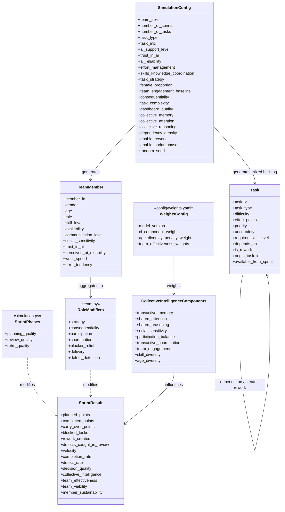
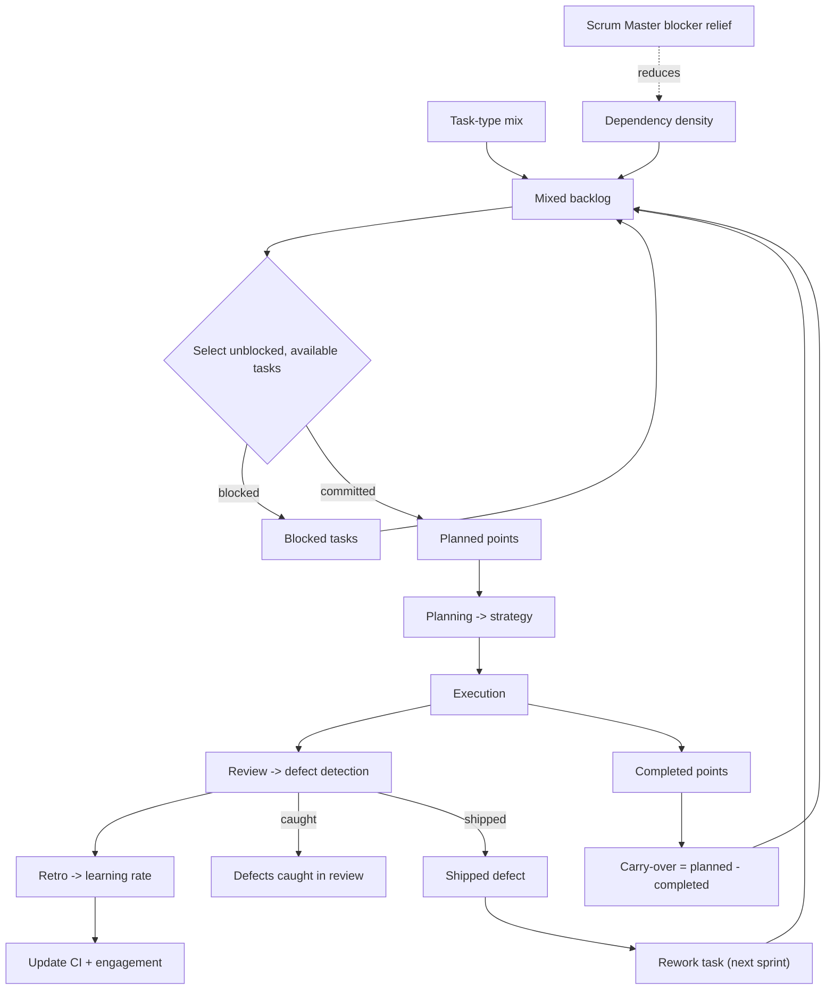

# Detailed UML + CI → Agile Performance Analysis

> **Model version 2.0.** This revision documents the improved simulator:
> externalized weights (`config/weights.yaml`), mixed backlogs with carry-over,
> task dependencies and defect rework, sprint-phase modifiers, and Scrum roles.
> See [§7 Model v2.0 additions](#7-model-v20-additions).

This document gives a **detailed UML model** of the Agile AI Simulator, an **annotated map of how Collective Intelligence (CI) connects to agile team performance**, and a **research-paper analysis** showing which paper justifies each link. The fine-tuned framing uses **Riedl et al. (2021)** to identify predictor items and **Kommol, Riedl & Woolley (2025)** to assign those items to CI systems: collective/shared memory, collective attention, and collective reasoning. The percentages shown here are **model weights used for transparent simulation**, not coefficients estimated from empirical Scrum datasets. In model v2.0 these weights are loaded from `config/weights.yaml` and the active set is stamped with a `model_version` in every run summary.

All Mermaid blocks can be pasted into [mermaid.live](https://mermaid.live). Standalone copies live in [`diagrams/`](diagrams/).

---

## Table of contents

1. [Detailed UML class diagram](#1-detailed-uml-class-diagram)
2. [How CI connects to agile team performance](#2-how-ci-connects-to-agile-team-performance)
3. [CI → performance impact map (with paper citations)](#3-ci--performance-impact-map-with-paper-citations)
4. [Per-component impact table](#4-per-component-impact-table)
5. [Where agile variables and weights come from](#5-where-agile-variables-and-weights-come-from)
6. [Research-paper analysis](#6-research-paper-analysis)
7. [Model v2.0 additions](#7-model-v20-additions)

---

## 1. Detailed UML class diagram

The class diagram below reflects the v2.0 structure, including externalized
weights (`WeightsConfig`), Scrum roles and their modifiers, task dependencies
and rework on `Task`, the sprint-phase modifiers, and the expanded per-sprint
result record.

The end-to-end backlog and workflow loop (mixed backlog → dependency blocking →
sprint phases → carry-over and rework feedback) is shown below.

---

## 2. How CI connects to agile team performance

**Core idea:** an agile team is a time-boxed collective that must coordinate, decide, and learn each sprint. CI is the team's capacity to do this well. In the simulator, CI is **both a driver and an outcome** of agile performance. Riedl et al. (2021) are used mainly to identify CI/performance predictor items; Kommol et al. (2025) are used to organize those predictors into CI systems.

**Memory terminology:** `collective_memory` is the user-controlled/shared-memory baseline: what the team can retain and reuse across sprints. `transactive_memory` is the computed mechanism: who knows what, whether expertise is recognized, and whether skills/knowledge coordination lets the team access that knowledge. In other words, shared memory is the state; transactive memory is how that state becomes useful in teamwork.

| Agile team reality | CI construct in the model | Agile variable(s) in simulator | Paper |
|---|---|---|---|
| Shared retained knowledge across sprints | `collective_memory` input | Sidebar input; evolves each sprint; feeds `Transactive Memory` in results | Kommol, Riedl & Woolley (2025); Woolley & Mayo (2025) |
| Who knows what on the team | `transactive_memory`; fed by individual skill, skill diversity, and knowledge/skills process | Computed CI subcomponent; sprint column `Transactive Memory` | Wegner (1987); Lewis (2003); Riedl et al. (2021) |
| Everyone focused on the sprint goal | `shared_attention`; fed by effort-related process, consequentiality, participation balance, and coordination demand | Computed subcomponent `Shared Attention`; also feeds `Decision Quality` | Mathieu et al. (2000); Kommol et al. (2025); Riedl et al. (2021) |
| Good joint planning / technical decisions | `shared_reasoning`; fed by strategy updating process, social perceptiveness, and knowledge/skills process | Computed subcomponent `Shared Reasoning`; feeds `Decision Quality` | Bahrami et al. (2010); Kommol et al. (2025); Riedl et al. (2021) |
| Members read and adapt to each other | `social_sensitivity` | Per-member attribute -> team average; `Social Sensitivity`; feeds CI and decision quality | Woolley et al. (2010); Engel et al. (2014) |
| No single person dominates | `participation_balance` | Computed from `communication_level` spread; `Participation Balance` | Woolley et al. (2010) |
| Coordinating who does what | `transactive_coordination` | `Transactive Coordination`; uses memory, coordination need, and participation balance | Strode et al. (2012); Strode, Dingsøyr & Lindsjørn (2022) |
| Consequential shared purpose | `consequentiality` upstream of team engagement, shared attention, viability, and sustainability | Sidebar `Consequentiality / shared purpose`; drives engagement, attention, viability, and sustainability | Hackman (2002); Wageman et al. (2005); professor feedback |
| Team motivation / involvement | `team_engagement`, explicitly team-level rather than individual engagement | `Team Engagement`; +5% direct completion effect; contributes to viability and sustainability | Kozlowski & Ilgen (2006); Riedl et al. (2021) |
| Complementary skills | `skill_diversity`, distinct from individual `skill_level` and knowledge/skills process | Computed from `skill_level` spread; `Skill Diversity` | Hong & Page (2004) |
| Age spread | `age_diversity`, modeled as a negative CI predictor | Computed from generated age; `Age Diversity`; negative CI penalty | Professor feedback; diversity discussion |
| Female proportion | Proxy pathway through `social_sensitivity` when social perceptiveness is not directly measured | Sidebar `Female proportion` -> generated member social sensitivity baseline | Woolley et al. (2010); Riedl et al. (2021) |
| Scrum-specific effectiveness context | delivery, responsiveness, improvement, autonomy | `Sprint Velocity`, `Task Completion Rate`, `Defect Rate`, `Team Effectiveness`, `Team Viability` | Verwijs & Russo (2023) |
| Effort allocation / overload | effort-related process | `Effort Process`, planned capacity, overload penalty, `Overload Pressure` | Riedl et al. (2021); Hackman/Wageman |
| Matching skills to work | knowledge/skills process | `Knowledge Skills Process`; transactive memory, defect probability, decision quality | Riedl et al. (2021); Wegner/Lewis |
| Updating work approach | strategy updating process | `Strategy Process`; allocation quality, shared reasoning, decision quality, completion probability | Riedl et al. (2021); Marks et al. |
| Task coordination demand | coordination need | Derived from task type profile in `tasks.py`; affects attention, coordination, completion, and decision quality | Strode et al. (2012); Moe et al. (2010) |
| Sprint delivery | velocity and completion | `Planned Points`, `Completed Points`, `Sprint Velocity`, `Task Completion Rate` | Agile/Scrum practice |
| Quality | defects | `Defects`, `Defect Rate` | Agile quality metrics |
| Future team capacity | viability | `Team Viability (%)` | Hackman (1987); Wageman et al. (2005) |
| Member load / burnout risk | sustainability | `Member Sustainability (%)`, `Overload Pressure` | Hackman/Wageman |
| AI support effect | AI benefit | `AI Benefit Score`, `Trust Calibration`, allocation and dashboard gains | Human-AI trust literature |
| Mixed work and unfinished commitments | `task_mix` and `carry_over` | Sidebar task-mix sliders; `Task Mix`, `Carry-Over Points`, `Carry-Over Tasks`, `Carry-Over Rate` | Agile/Scrum practice; Marks et al. (2001) |
| Task blockers / waiting on upstream work | `depends_on` blocker propagation | `Blocked Tasks`; unavailable work skipped until dependencies complete | Strode et al. (2012); Moe, Dingsøyr & Dybå (2010) |
| Quality debt creating future work | defect `rework` spillover | `Rework Created`, `Rework Completed`; fix tasks appear in later sprints | Agile quality practice; Hackman process criteria |
| Sprint rhythm | sprint-phase modifiers | `Planning Quality`, `Review Quality`, `Retro Learning Multiplier` | Marks, Mathieu & Zaccaro (2001); Kozlowski & Ilgen (2006) |
| Scrum roles as behavioral modifiers | `role` field on `TeamMember` | Product Owner, Scrum Master, Developer, Tester modifiers in `team.py` | Hoda, Noble & Marshall (2013) |

---

## 3. CI → performance impact map (with paper citations)

**Three pathways CI affects agile performance:**

1. **Direct via aggregate CI** — the combined CI score raises task completion probability (+10% in the task-completion formula).
2. **Indirect via decision quality** — reasoning, attention, social perceptiveness, strategy updating process, and knowledge/skills process raise `decision_quality`, which increases completion (+8%) and reduces defects (-10%).
3. **Direct engagement boost** — team-level `team_engagement` adds +5% to completion on top of its CI contribution.
4. **Hackman effectiveness layer** — team effectiveness now combines task output, team viability, and member sustainability instead of treating velocity as the only success criterion.
5. **Consequentiality/shared purpose** — consequential work strengthens shared attention, team engagement, viability, and sustainability.

Plus a **feedback loop**: good sprint outcomes raise memory, attention, reasoning, and engagement for the next sprint, so CI and agile performance co-evolve.

---

## 4. Per-component impact table

| CI component | CI weight | Why this weight | Agile variable(s) affected | Path to agile performance |
|---|---:|---|---|---|
| Transactive memory | 18% | Highest positive CI weight because memory is a core Kommol CI system and central to "who knows what" in agile work | `Collective Intelligence Score`, `Transactive Memory`, indirect `Decision Quality` | -> aggregate CI -> completion -> velocity/completion -> task output and viability |
| Shared attention | 16% | Same high tier as reasoning/social sensitivity: attention is one of Kommol's three systems and captures sprint focus | `Shared Attention`, `Decision Quality` (+16% input) | -> CI and decision quality -> completion and fewer defects |
| Shared reasoning | 16% | Same high tier: joint planning and technical decisions are central to agile performance and are the largest input to decision quality | `Shared Reasoning`, `Decision Quality` (+24% input) | -> CI and decision quality -> completion, defects, effectiveness |
| Social sensitivity | 16% | Same high tier because Woolley/Riedl identify social perceptiveness as a major CI predictor | `Social Sensitivity`, `Decision Quality` (+12% input) | -> CI and decision quality -> completion and defects |
| Participation balance | 10% | Supporting Woolley factor; important for CI but not one of Kommol's three core systems | `Participation Balance`, `Transactive Coordination` | -> aggregate CI and transactive coordination |
| Transactive coordination | 10% | Agile coordination support; important but partly overlaps with attention/reasoning processes | `Transactive Coordination`, completion via CI | -> aggregate CI -> completion and viability |
| Team engagement | 8% | Emergent team state; smaller CI weight because it also has a separate direct +5% effect on completion | `Team Engagement`, completion, viability, sustainability | -> CI and direct +5% completion; also viability/sustainability |
| Skill diversity | 6% | Smallest positive CI weight because diversity helps, but the model gives more influence to process and social-cognitive systems | `Skill Diversity`, `Collective Intelligence Score` | -> aggregate CI; complementary expertise for complex agile work |
| Age diversity | -4% penalty | Negative modifier rather than a positive CI component; kept smaller than the main positive weights so it does not dominate the model | `Age Diversity`, reduced `Collective Intelligence Score` | -> negative CI adjustment |

Again, the percentages are **simulation weights** chosen for transparency and sensitivity analysis. They should be presented as model assumptions, not as empirical effect sizes from the cited papers.

The positive CI weights sum to 100%: 18 + 16 + 16 + 16 + 10 + 10 + 8 + 6. This makes the CI score easy to explain as a weighted average of subconstructs, while age diversity is applied separately as a small penalty.

---

## 5. Where agile variables and weights come from

**Where agile variables come from:** Agile outcomes (`velocity`, `completion_rate`, `defect_rate`, `team_effectiveness`, `team_viability`, `member_sustainability`, `overload_pressure`) are computed each sprint in `simulation.py` from task completion/defect draws, planned capacity, workload, trust calibration, and backlog state. CI constructs are computed in `metrics.py` from team members, process sliders, task coordination need, and evolving memory/attention/reasoning baselines. Process measures (`effort_management`, `skills_knowledge_coordination`, `task_strategy`) are internal variable names displayed as effort-related process, knowledge/skills process, and strategy updating process.

**Why specific percentages:** The weights prioritize Kommol's memory/attention/reasoning systems and Woolley/Riedl's social perceptiveness in the 16-18% tier. Balance, coordination, engagement, and diversity receive smaller weights because they support CI but are not treated as the main CI systems. Separate direct effects on completion (+10% CI, +8% decision quality, +5% team engagement) let CI influence agile performance both through the aggregate CI score and through decision quality and engagement.

### 5.1 CI aggregate weights

| Weight | Implemented in code | Explanation |
|---:|---|---|
| 18% | `transactive_memory` in `CI_COMPONENT_WEIGHTS` | Highest positive CI weight because memory/who-knows-what is the main way collective/shared memory becomes useful in sprint work. |
| 16% | `shared_attention` | High tier because shared attention is a core Kommol CI system and directly supports decision quality. |
| 16% | `shared_reasoning` | High tier because reasoning is a core Kommol CI system and the largest driver of decision quality. |
| 16% | `social_sensitivity` | High tier because Woolley/Riedl emphasize social perceptiveness as a major CI predictor. |
| 10% | `participation_balance` | Medium support weight: important for CI, but mostly a participation condition rather than a full memory/attention/reasoning system. |
| 10% | `transactive_coordination` | Medium support weight: captures agile coordination, partly overlapping with attention and memory. |
| 8% | `team_engagement` | Lower CI weight because engagement also affects completion, viability, and sustainability outside the CI aggregate. |
| 6% | `skill_diversity` | Smallest positive weight because diversity helps but is treated as a supporting composition factor. |
| -4% | `AGE_DIVERSITY_PENALTY_WEIGHT` | Small negative adjustment, reflecting the professor's note without making age spread dominate the model. |

### 5.2 Internal CI subcomponent formulas

| Formula | Weights | Why |
|---|---|---|
| Transactive memory | 40% collective memory, 25% knowledge/skills process, 20% skill diversity, 15% average individual skill | Memory baseline dominates; process and diversity operationalize who knows what. |
| Shared attention | 42% collective attention, 18% effort-related process, 15% consequentiality, 16% participation balance, 9% coordination need | Baseline focus is largest; effort, purpose, participation, and coordination demand refine shared sprint attention. |
| Shared reasoning | 50% collective reasoning, 25% strategy updating process, 15% social sensitivity, 10% knowledge/skills process | Reasoning baseline is primary; strategy process is the main Riedl/Hackman predictor for adapting the work approach. |
| Transactive coordination | 40% memory, 35% coordination need, 25% participation balance | Coordination depends on knowing where expertise is, task coordination demand, and balanced participation. |

### 5.3 Direct performance weights in `simulation.py`

| Model area | Implemented weights | Explanation |
|---|---|---|
| Task completion probability | +10% collective intelligence, +8% decision quality, +5% task strategy, +5% team engagement, +8% AI bonus | CI has a direct performance effect, but individual skill, task difficulty, fit, and AI still matter. This avoids making CI the only driver. |
| Defect probability | -10% decision quality, -5% knowledge/skills process, -8% AI quality bonus | Better decisions, better expertise matching, and reliable AI support reduce defects. |
| Decision quality | 24% reasoning, 16% attention, 14% coordination need, 12% social sensitivity, 10% dashboard quality, 10% AI bonus, 8% strategy process, 6% knowledge/skills process | Reasoning receives the largest share because decision quality is mainly a reasoning task; attention and social sensitivity support it. |
| Outcome signal | 45% completion rate, 35% velocity ratio, 20% quality | Sprint learning is driven mainly by finishing planned work, then velocity, then low defects. |
| Team engagement update | 4% outcome signal, 3% decision quality, 2% trust calibration, 3% consequentiality | Engagement improves after good outcomes, good decisions, calibrated trust, and meaningful shared purpose. |

### 5.4 Hackman-style effectiveness weights

| Layer | Weight | Why |
|---|---:|---|
| Task output | 55% | Delivery still matters most in agile sprints. Internally this combines 40% velocity ratio, 35% completion rate, and 25% quality (`1 - defect_rate`). |
| Team viability | 25% | Future capacity to continue working well together. It is computed from 40% CI, 20% team engagement, 20% consequentiality, 15% trust calibration, and 5% decision quality. |
| Member sustainability | 20% | Captures overload and burnout risk. It is computed from 35% engagement, 25% consequentiality, 25% effort-related process, and 15% low overload pressure. |

### 5.5 Model v2.0 workflow additions

| Model area | Implemented variables | Explanation |
|---|---|---|
| Mixed backlog | `task_mix`, `Task Mix` | Configurable proportions for features, bugs, refactors, and spikes. The app normalizes the selected mix to 100%. |
| Carry-over | `Carry-Over Points`, `Carry-Over Tasks`, `carry_over_rate` | Planned work not finished in the sprint is reported explicitly instead of disappearing from the model. |
| Dependencies | `depends_on`, `Blocked Tasks`, `dependency_density` | Blocked tasks are skipped until dependencies complete, making blocker pressure visible across sprints. |
| Rework | `is_rework`, `origin_task_id`, `available_from_sprint`, `Rework Created`, `Rework Completed` | Shipped defects create later fix tasks, so quality issues consume future sprint capacity. |
| Sprint phases | `Planning Quality`, `Review Quality`, `Retro Learning Multiplier` | Planning affects strategy, review catches defects, and retrospective quality scales CI/engagement learning. |
| Roles | `role`, `role_effects()` | Product Owner, Scrum Master, Developer, and Tester roles add small behavioral modifiers. |

---

## 6. Research-paper analysis

### A. Papers linking CI to team performance (general groups)

| Paper | Main finding | Use in simulator |
|---|---|---|
| **Woolley et al. (2010)** *Science* | A general CI factor (c) predicts group performance; driven by social sensitivity and equal participation, not average IQ | Aggregate CI, social sensitivity, participation balance, female proportion |
| **Riedl et al. (2021)** *PNAS* | CI predicts performance; Fig. 2-D highlights collaboration-process measures: effort, strategy, skill congruence / knowledge-skills use | Main source for predictor items |
| **Kommol, Riedl & Woolley (2025)** *OSF Preprints* | CI structure is best explained through collective memory, attention, and reasoning | Assigns Riedl items to CI systems |
| **Engel et al. (2014)** *PLOS ONE* | Theory of mind predicts CI online and face-to-face | `social_sensitivity` in distributed agile teams |
| **DeChurch & Mesmer-Magnus (2010)** *JAP* | Meta-analysis: team cognition predicts performance | CI reported separately from delivery metrics |
| **Kozlowski & Ilgen (2006)** *PSPI* | Effectiveness = inputs → processes → emergent states → outcomes | The whole input→process→state→outcome architecture + feedback |
| **Mathieu et al. (2000)** *JAP* | Shared mental models improve process and performance | `shared_attention`, `shared_reasoning`, dashboard |
| **Bahrami et al. (2010)** *Science* | Joint decisions beat individuals when confidence is shared | `decision_quality` as team-level |
| **Hong & Page (2004)** *PNAS* | Diverse solvers beat uniformly high-ability ones | `skill_diversity` in CI |
| **Wegner (1987); Lewis (2003)** | Transactive memory: who knows what + coordination | `collective_memory`, transactive memory subconstruct |
| **Hackman (1987, 2002); Wageman et al. (2005)** | Process criteria and effectiveness conditions distinguish effort, strategy, knowledge/skills process, output, viability, and member sustainability | Process-measure labels, consequentiality/shared purpose, team effectiveness |

### B. Papers linking team cognition to **agile** performance (closest to your question)

| Paper | Main finding | Use in simulator |
|---|---|---|
| **Moe, Dingsøyr & Dybå (2010)** *IST* | Agile effectiveness depends on trust, shared mental models, coordination | Coordination by task type, trust, CI |
| **Lindsjørn et al. (2016)** *JSS* | Teamwork quality predicts agile project success | `team_effectiveness` as multi-dimensional KPI |
| **Strode et al. (2012)** *JSS* | Agile coordination via synchronization, structure, boundary spanning | `transactive_coordination`, dashboard |
| **Marks, Mathieu & Zaccaro (2001)** *AMR* | Team processes: transition, action, interpersonal | Additional support for effort-related, knowledge/skills, and strategy updating processes |
| **Hoda et al. (2013)** *IEEE TSE* | Informal self-organizing roles in agile teams | Role modifiers for Product Owner, Scrum Master, Developer, and Tester |

### C. Strong extensions beyond the original 30-paper set

| Paper | Why it matters |
|---|---|
| **Dingsøyr, Moe et al. (2022)** — Agile Teamwork Effectiveness Model (ATEM), *Empirical Software Engineering* | Formal agile model: effectiveness via shared leadership, adaptability, redundancy, coordinated through shared mental models, communication, trust |
| **Gupta (2022, CMU dissertation)** — CI in open-source software teams | Empirically tests transactive systems (memory, attention, reasoning) on 476 GitHub teams — direct CI + software team evidence |

---

## 7. Model v2.0 additions

Model v2.0 keeps the CI → agile performance core intact and adds tooling,
backlog/workflow realism, modest team-structure depth, and validation. Every
addition is a **transparent simulation assumption**, consistent with the rest of
the document.

### 7.1 Externalized, versioned weights

The aggregate CI weights, the age-diversity penalty, and the team-effectiveness
layer are loaded from `config/weights.yaml` through `config_loader.py`. The file
also carries a `model_version`, surfaced at
`run_simulation(...)["summary"]["model_version"]`. This makes the weighting
scheme tunable and citable without editing Python source; the positive CI
weights still sum to 1.0.

### 7.2 Mixed backlogs and carry-over

The backlog is generated from a configurable `task_mix` (features, bugs,
refactors, spikes; normalized to 100%). Each sprint records **planned vs
completed** points, and **carry-over** (committed work that did not finish) is a
first-class metric. This moves the model beyond one task type and one-shot
sprint execution.

### 7.3 Dependencies, blockers, and rework

Tasks may carry a `depends_on` link to an upstream task. A task cannot start
until its dependencies complete, so **blocked tasks** are reported separately
from carry-over. When a completed task ships a defect, a **rework** fix task is
created and becomes available in a later sprint, so quality problems consume
future capacity. A Scrum Master reduces effective blocker density.

### 7.4 Sprint-phase modifiers

Three lightweight phase modifiers layer on top of the existing update functions:

| Phase | Effect | Implemented as |
|---|---|---|
| Planning | Strengthens the work strategy used downstream | `planning_quality` raises the effective `task_strategy` |
| Review | Catches a share of defects before they ship | `review_quality` can prevent a defect (and its rework) |
| Retrospective | Scales how fast the team learns | `retro_quality` multiplies CI and engagement updates |

### 7.5 Roles as behavioral modifiers

A lightweight `role` field (Product Owner, Scrum Master, Developer, Tester)
adds small, interpretable nudges: the Product Owner sharpens strategy and shared
purpose; the Scrum Master improves coordination/participation and relieves
blockers; Testers raise in-review defect detection; Developers add a small
delivery effect. Roles do not replace the per-member attributes; they modulate
them.

### 7.6 New output metrics

In addition to the original metrics, v2.0 reports `carry_over_points`,
`carry_over_rate`, `blocked_tasks`, `rework_created`, `rework_completed`, and
`defects_caught_in_review`. Sensitivity analysis was broadened to include
consequentiality, the CI baselines, and dependency density, and now includes a
**sensitivity-stability summary** that quantifies how much each outcome swings
across a parameter sweep. A `pytest` suite validates the metrics formulas,
monotonic behavior, and deterministic reproducibility.

---

## Source files

| Module | Classes / functions |
|---|---|
| `simulation.py` | `SimulationConfig`, `run_simulation`, completion/defect/CI-update logic, sprint phases, carry-over, rework |
| `team.py` | `TeamMember`, `generate_team`, `role_effects` |
| `tasks.py` | `Task`, `TASK_TYPE_PROFILES`, mixed backlog, dependencies, rework |
| `metrics.py` | `CollectiveIntelligenceComponents`, scoring functions |
| `ai_support.py` | Allocation, shared cognition, trust updates |
| `config_loader.py` / `config/weights.yaml` | Externalized, versioned model weights |
| `experiments.py` | Monte Carlo, sensitivity sweep, sensitivity-stability summary |
| `tests/` | Metrics, monotonic, and deterministic smoke tests (`pytest`) |
