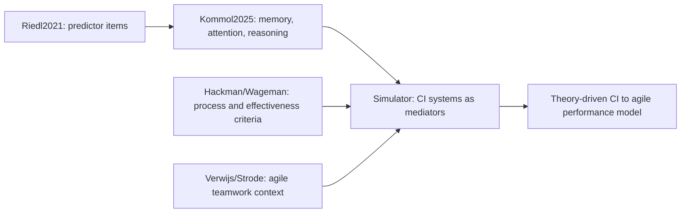

# Detailed UML + CI → Agile Performance Analysis

This document gives a **detailed UML model** of the Agile AI Simulator, an **annotated map of how Collective Intelligence (CI) connects to agile team performance**, and a **research-paper analysis** showing which paper justifies each link. The fine-tuned framing uses **Riedl et al. (2021)** to identify predictor items and **Kommol, Riedl & Woolley (2025)** to assign those items to CI systems: collective/shared memory, collective attention, and collective reasoning. The percentages shown here are **model weights used for transparent simulation**, not coefficients estimated from empirical Scrum datasets.

All Mermaid blocks can be pasted into [mermaid.live](https://mermaid.live). Standalone copies live in [`diagrams/`](diagrams/).

---

## Table of contents

1. [Detailed UML class diagram](#1-detailed-uml-class-diagram)
2. [How CI connects to agile team performance](#2-how-ci-connects-to-agile-team-performance)
3. [CI → performance impact map (with paper citations)](#3-ci--performance-impact-map-with-paper-citations)
4. [Per-component impact table](#4-per-component-impact-table)
5. [Research-paper analysis](#5-research-paper-analysis)
6. [The conceptual bridge (thesis framing)](#6-the-conceptual-bridge-thesis-framing)

---

## 1. Detailed UML class diagram

---

## 2. How CI connects to agile team performance

**Core idea:** an agile team is a time-boxed collective that must coordinate, decide, and learn each sprint. CI is the team's capacity to do this well. In the simulator, CI is **both a driver and an outcome** of agile performance. Riedl et al. (2021) are used mainly to identify CI/performance predictor items; Kommol et al. (2025) are used to organize those predictors into CI systems.

**Memory terminology:** `collective_memory` is the user-controlled/shared-memory baseline: what the team can retain and reuse across sprints. `transactive_memory` is the computed mechanism: who knows what, whether expertise is recognized, and whether skills/knowledge coordination lets the team access that knowledge. In other words, shared memory is the state; transactive memory is how that state becomes useful in teamwork.

| Agile team reality | CI construct in the model | Paper |
|---|---|---|
| Shared retained knowledge across sprints | `collective_memory` input | Kommol, Riedl & Woolley (2025); Woolley & Mayo (2025) |
| Who knows what on the team | `transactive_memory`; fed by individual skill, skill diversity, and knowledge/skills process | Wegner (1987); Lewis (2003); Riedl et al. (2021) |
| Everyone focused on the sprint goal | `shared_attention`; fed by effort-related process, consequentiality, participation balance, and coordination demand | Mathieu et al. (2000); Kommol et al. (2025); Riedl et al. (2021) |
| Good joint planning / technical decisions | `shared_reasoning`; fed by strategy updating process, social perceptiveness, and knowledge/skills process | Bahrami et al. (2010); Kommol et al. (2025); Riedl et al. (2021) |
| Members read and adapt to each other | `social_sensitivity` | Woolley et al. (2010); Engel et al. (2014) |
| No single person dominates | `participation_balance` | Woolley et al. (2010) |
| Coordinating who does what | `transactive_coordination` | Strode et al. (2012); Strode, Dingsøyr & Lindsjørn (2022) |
| Consequential shared purpose | `consequentiality` upstream of team engagement, shared attention, viability, and sustainability | Hackman (2002); Wageman et al. (2005); professor feedback |
| Team motivation / involvement | `team_engagement`, explicitly team-level rather than individual engagement | Kozlowski & Ilgen (2006); Riedl et al. (2021) |
| Complementary skills | `skill_diversity`, distinct from individual `skill_level` and knowledge/skills process | Hong & Page (2004) |
| Age spread | `age_diversity`, modeled as a negative CI predictor | Professor feedback; diversity discussion |
| Female proportion | Proxy pathway through `social_sensitivity` when social perceptiveness is not directly measured | Woolley et al. (2010); Riedl et al. (2021) |
| Scrum-specific effectiveness context | delivery, responsiveness, improvement, autonomy | Verwijs & Russo (2023) |

---

## 3. CI → performance impact map (with paper citations)

**Three pathways CI affects agile performance:**

1. **Direct via aggregate CI** — the combined CI score raises task completion probability (+10% in the task-completion formula).
2. **Indirect via decision quality** — reasoning, attention, social perceptiveness, strategy updating process, and knowledge/skills process raise `decision_quality`, which increases completion (+8%) and reduces defects (-10%).
3. **Direct engagement boost** — team-level `team_engagement` adds +5% to completion on top of its CI contribution.
4. **Hackman effectiveness layer** — team effectiveness now combines task output, team viability, and member sustainability instead of treating velocity as the only success criterion.
5. **Consequentiality/shared purpose** — consequential work strengthens shared attention, team engagement, viability, and sustainability.

Plus a **feedback loop**: good sprint outcomes raise memory, attention, reasoning, and engagement for the next sprint, so CI and agile performance co-evolve.

---

## 4. Per-component impact table

| CI component | CI weight | Main predictors / support | Path to agile performance |
|---|--:|:--:|---|
| Transactive memory | 18% | Collective/shared memory, individual skill, skill diversity, knowledge/skills process | → aggregate CI → completion → velocity/completion → task output and viability |
| Shared attention | 16% | Collective attention, effort-related process, consequentiality/shared purpose, participation balance, coordination need | → CI **and** decision quality → completion and fewer defects |
| Shared reasoning | 16% | Collective reasoning, strategy updating process, social perceptiveness, knowledge/skills process | → CI **and** decision quality → completion, defects, effectiveness |
| Social sensitivity | 16% | Social perceptiveness; female proportion only as proxy pathway when social perceptiveness is not directly measured | → CI **and** decision quality → completion and defects |
| Participation balance | 10% | Balanced contribution / communication distribution | → aggregate CI and transactive coordination |
| Transactive coordination | 10% | Memory, coordination need, participation balance | → aggregate CI → completion and viability |
| Team engagement | 8% | Emergent motivation and involvement | → CI **and** direct +5% completion; also team viability/sustainability |
| Skill diversity | 6% | Spread in technical skill levels | → aggregate CI; complementary expertise for complex agile work |
| Age diversity | penalty | Spread in member ages | → negative CI adjustment |

Again, the percentages are **simulation weights** chosen for transparency and sensitivity analysis. They should be presented as model assumptions, not as empirical effect sizes from the cited papers.

---

## 5. Research-paper analysis

### A. Papers linking CI to team performance (general groups)

| Paper | Main finding | Use in simulator |
|---|---|---|
| **Woolley et al. (2010)** *Science* | A general CI factor (c) predicts group performance; driven by social sensitivity and equal participation, not average IQ | Aggregate CI, social sensitivity, participation balance, female proportion |
| **Riedl et al. (2021)** *PNAS* | CI predicts performance; Fig. 2-D highlights collaboration-process measures: effort, strategy, skill congruence / knowledge-skills use | Main source for predictor items |
| **Kommol, Riedl & Woolley (2025)** *OSF Preprints* | CI structure is best explained through collective memory, attention, and reasoning | Assigns Riedl items to CI systems |
| **Engel et al. (2014)** *PLOS ONE* | Theory of mind predicts CI online and face-to-face | `social_sensitivity` in distributed agile teams |
| **DeChurch & Mesmer-Magnus (2010)** *JAP* | Meta-analysis: team cognition predicts performance | CI reported separately from delivery metrics |
| **Kozlowski & Ilgen (2006)** *PSPI* | Effectiveness = inputs → processes → emergent states → outcomes | The whole input→process→state→outcome architecture + feedback |
| **Mathieu et al. (2000)** *JAP* | Shared mental models improve process and performance | `shared_attention`, `shared_reasoning`, dashboard |
| **Bahrami et al. (2010)** *Science* | Joint decisions beat individuals when confidence is shared | `decision_quality` as team-level |
| **Hong & Page (2004)** *PNAS* | Diverse solvers beat uniformly high-ability ones | `skill_diversity` in CI |
| **Wegner (1987); Lewis (2003)** | Transactive memory: who knows what + coordination | `collective_memory`, transactive memory subconstruct |
| **Hackman (1987, 2002); Wageman et al. (2005)** | Process criteria and effectiveness conditions distinguish effort, strategy, knowledge/skills process, output, viability, and member sustainability | Process-measure labels, consequentiality/shared purpose, team effectiveness |

### B. Papers linking team cognition to **agile** performance (closest to your question)

| Paper | Main finding | Use in simulator |
|---|---|---|
| **Moe, Dingsøyr & Dybå (2010)** *IST* | Agile effectiveness depends on trust, shared mental models, coordination | Coordination by task type, trust, CI |
| **Lindsjørn et al. (2016)** *JSS* | Teamwork quality predicts agile project success | `team_effectiveness` as multi-dimensional KPI |
| **Strode et al. (2012)** *JSS* | Agile coordination via synchronization, structure, boundary spanning | `transactive_coordination`, dashboard |
| **Marks, Mathieu & Zaccaro (2001)** *AMR* | Team processes: transition, action, interpersonal | Additional support for effort-related, knowledge/skills, and strategy updating processes |
| **Hoda et al. (2013)** *IEEE TSE* | Informal self-organizing roles in agile teams | Future role-based extension |

### C. Strong extensions beyond the original 30-paper set

| Paper | Why it matters |
|---|---|
| **Dingsøyr, Moe et al. (2022)** — Agile Teamwork Effectiveness Model (ATEM), *Empirical Software Engineering* | Formal agile model: effectiveness via shared leadership, adaptability, redundancy, coordinated through shared mental models, communication, trust |
| **Gupta (2022, CMU dissertation)** — CI in open-source software teams | Empirically tests transactive systems (memory, attention, reasoning) on 476 GitHub teams — direct CI + software team evidence |

---

## 6. The conceptual bridge (thesis framing)

The simulator's CI → agile performance link is a **deliberate integration of two literatures**, not a single established empirical result.

**Say this (accurate):**
> Riedl et al. (2021), especially Fig. 2-D, are used to identify predictor items such as effort-related process, strategy updating process, knowledge/skills process, individual skill, diversity, and social perceptiveness. Kommol et al. (2025) are then used to assign these predictors to the CI systems of collective/shared memory, collective attention, and collective reasoning. Hackman/Wageman provide the process and effectiveness framing, while Verwijs/Strode ground the agile/Scrum team-performance context.

**Do not overclaim:**
> Woolley/Riedl/Kommol did **not** estimate coefficients for agile velocity. Female proportion should be presented as a proxy route through social perceptiveness when social perceptiveness is not directly measured. The prototype is theory-driven, not empirically calibrated on agile datasets.

---

## Source files

| Module | Classes / functions |
|---|---|
| `simulation.py` | `SimulationConfig`, `run_simulation`, completion/defect/CI-update logic |
| `team.py` | `TeamMember`, `generate_team` |
| `tasks.py` | `Task`, `TASK_TYPE_PROFILES` |
| `metrics.py` | `CollectiveIntelligenceComponents`, scoring functions |
| `ai_support.py` | Allocation, shared cognition, trust updates |
